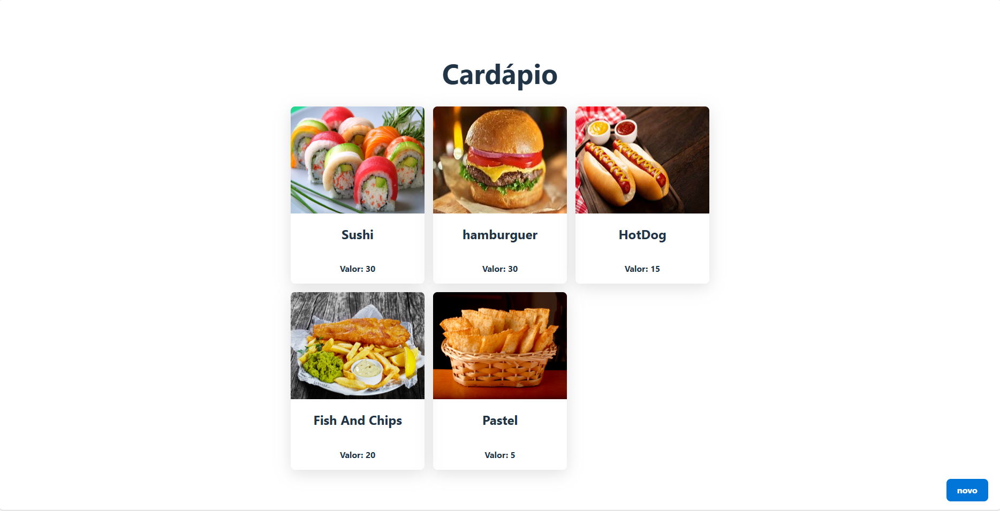

# Cardapio Online

O projeto consiste em um cardapio simples que permite o cadastro de alimentos com os respectivos título, valor e imagem. Foram utilizadas as seguintes tecnologias:

* Spring Boot
* PostgreSQL
* JPA (Hibernate)
* React
* TypeScript
* Axios

## Referências

- [@kipperdev](https://github.com/Fernanda-Kipper)